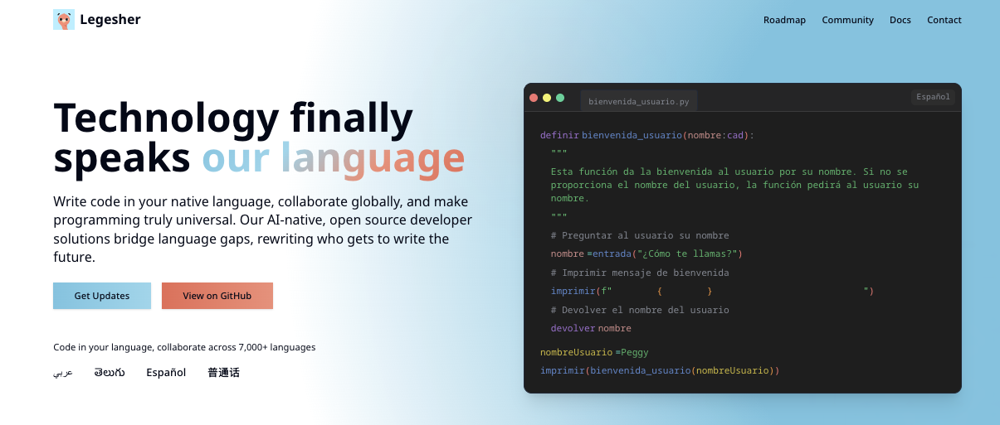

<h1 align="center"><a href="https://legesher.io">Legesher.io</a></h1>
<blockquote align="center">Legesher's public website: <a href="https://legesher.io">legesher.io</a></blockquote>

We create access for developers worldwide to code in context with their native language. Through native-language collaboration tools, we're empowering the next generation of global innovators to think, create, and solve problems in the language of their ideas—not be confined by the language of existing software.

<!-- DEVELOPMENT BADGES -->

    
    

<!-- SUPPORT BADGES -->

    
    
    

<!-- SOCIAL BADGES -->

    
    
    
    
    

---

## Contributing

Found a bug or have an idea? [Open an issue](https://github.com/legesher/legesher-dot-io/issues/new/choose) — each template includes setup instructions if you'd like to contribute a fix yourself.

For guidelines, see [CONTRIBUTING.md](.github/CONTRIBUTING.md) and our [Code of Conduct](https://docs.legesher.io/the-official-things/code-of-conduct).

### Contributors

<!-- ALL-CONTRIBUTORS-LIST:START - Do not remove or modify this section -->
<!-- prettier-ignore-start -->
<!-- markdownlint-disable -->
<table>
  <tbody>
    <tr>
      <td align="center" valign="top" width="14.28%"><a href="http://withmadi.co"> <b>Madison (Pfaff) Edgar</b></a> <a href="#projectManagement-madiedgar" title="Project Management">📆</a> <a href="https://github.com/legesher/legesher-dot-io/commits?author=madiedgar" title="Code">💻</a> <a href="#design-madiedgar" title="Design">🎨</a></td>
      <td align="center" valign="top" width="14.28%"><a href="https://ashleynarcisse.com"> <b>Ashley Narcisse</b></a> <a href="https://github.com/legesher/legesher-dot-io/commits?author=darkfadr" title="Code">💻</a> <a href="#infra-darkfadr" title="Infrastructure (Hosting, Build-Tools, etc)">🚇</a></td>
      <td align="center" valign="top" width="14.28%"><a href="http://www.larepaweb.com.ve"> <b>Heriberto Sosa</b></a> <a href="https://github.com/legesher/legesher-dot-io/commits?author=sosaheri" title="Documentation">📖</a></td>
      <td align="center" valign="top" width="14.28%"><a href="http://mphul.codes"> <b>Marissa</b></a> <a href="https://github.com/legesher/legesher-dot-io/commits?author=marissap" title="Code">💻</a> <a href="#design-marissap" title="Design">🎨</a></td>
      <td align="center" valign="top" width="14.28%"><a href="http://mythreya.dev"> <b>Mythreya Kuricheti</b></a> <a href="https://github.com/legesher/legesher-dot-io/issues?q=author%3AMythreyaK" title="Bug reports">🐛</a></td>
      <td align="center" valign="top" width="14.28%"><a href="https://github.com/Navneet78"> <b>navneet78</b></a> <a href="#marketing-Navneet78" title="Marketing - People who help in marketing the repo/project">💌</a></td>
      <td align="center" valign="top" width="14.28%"><a href="http://babrauskas.me"> <b>Federico Babrauskas</b></a> <a href="https://github.com/legesher/legesher-dot-io/commits?author=fedebabrauskas" title="Documentation">📖</a></td>
    </tr>
    <tr>
      <td align="center" valign="top" width="14.28%"><a href="https://github.com/rtkimz"> <b>rtkimz</b></a> <a href="https://github.com/legesher/legesher-dot-io/commits?author=rtkimz" title="Code">💻</a></td>
      <td align="center" valign="top" width="14.28%"><a href="http://www.irfansener.com"> <b>İrfan Şener</b></a> <a href="https://github.com/legesher/legesher-dot-io/commits?author=irfansener" title="Documentation">📖</a></td>
      <td align="center" valign="top" width="14.28%"><a href="https://github.com/shahkv95"> <b>Kush_Shah</b></a> <a href="https://github.com/legesher/legesher-dot-io/commits?author=shahkv95" title="Documentation">📖</a> <a href="https://github.com/legesher/legesher-dot-io/issues?q=author%3Ashahkv95" title="Bug reports">🐛</a></td>
      <td align="center" valign="top" width="14.28%"><a href="https://github.com/aortizoj15"> <b>Alexis Ortiz Ojeda</b></a> <a href="https://github.com/legesher/legesher-dot-io/commits?author=aortizoj15" title="Code">💻</a></td>
      <td align="center" valign="top" width="14.28%"><a href="https://github.com/ajtrichards"> <b>Alex Richards</b></a> <a href="#ideas-ajtrichards" title="Ideas, Planning, & Feedback">🤔</a></td>
      <td align="center" valign="top" width="14.28%"><a href="https://github.com/Mudit152001"> <b>Mudit152001</b></a> <a href="#ideas-Mudit152001" title="Ideas, Planning, & Feedback">🤔</a></td>
      <td align="center" valign="top" width="14.28%"><a href="http://mercode.org"> <b>Tan Siret G. AKINCI</b></a> <a href="#ideas-Yutyo" title="Ideas, Planning, & Feedback">🤔</a></td>
    </tr>
    <tr>
      <td align="center" valign="top" width="14.28%"><a href="https://github.com/srivastavaayu"> <b>Aayush Srivastava</b></a> <a href="#content-srivastavaayu" title="Content">🖋</a></td>
      <td align="center" valign="top" width="14.28%"><a href="https://github.com/jaebirds"> <b>jaebirds</b></a> <a href="https://github.com/legesher/legesher-dot-io/issues?q=author%3Ajaebirds" title="Bug reports">🐛</a></td>
      <td align="center" valign="top" width="14.28%"><a href="https://arunmohanraj.tech/"> <b>Arun Mohan Raj</b></a> <a href="https://github.com/legesher/legesher-dot-io/issues?q=author%3AARUNMOHANRAJ471" title="Bug reports">🐛</a></td>
    </tr>
  </tbody>
</table>

<!-- markdownlint-restore -->
<!-- prettier-ignore-end -->

<!-- ALL-CONTRIBUTORS-LIST:END -->

---

## License

MIT License — see [LICENSE](LICENSE) for details.

[Sponsor Legesher](https://github.com/sponsors/legesher) | [Visit legesher.io](https://legesher.io)
